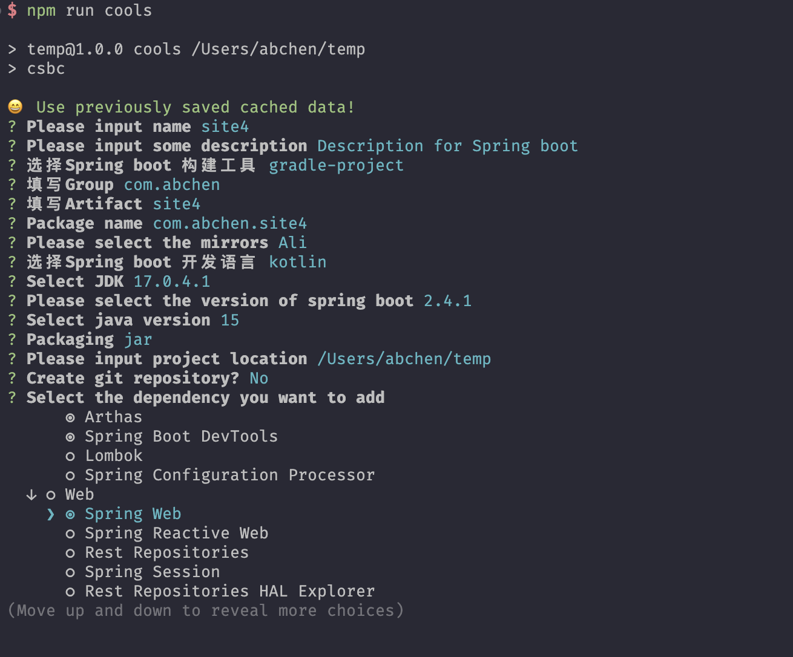
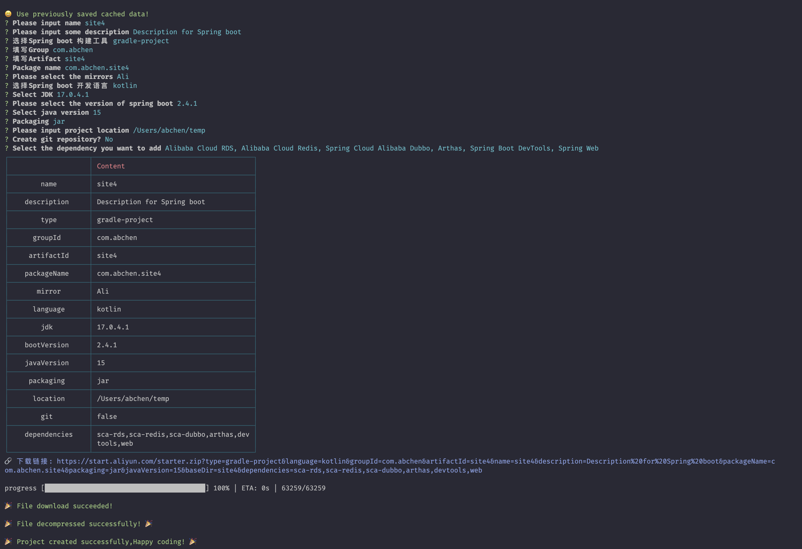
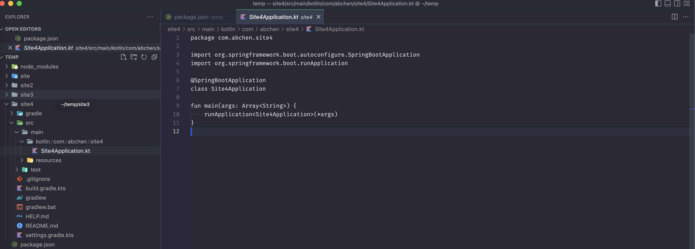

<h1 align=center>使用CLI创建Spring boot 项目</h1>

## install

```bash
# pnpm
pnpm add create-spring-boot-cli --global
# npm
npm install create-spring-boot-cli --global
# yarn
yarn add --global create-spring-boot-cli
```

## 使用

```bash
csbc
```

## 效果






