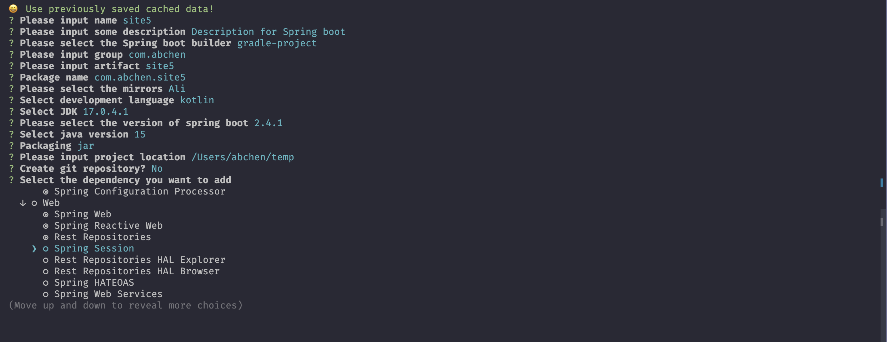
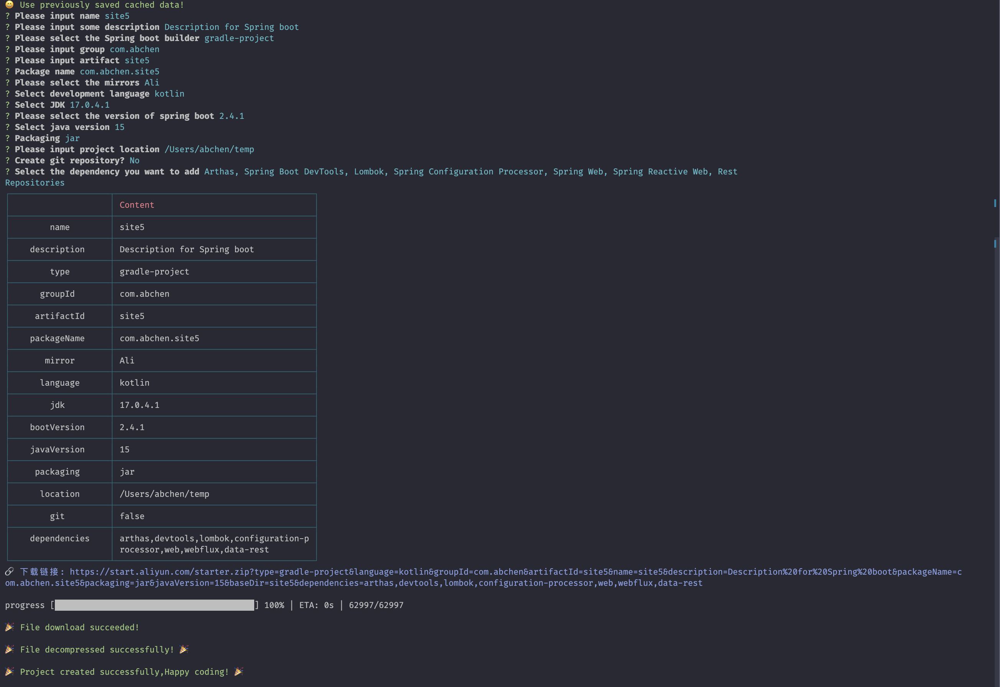
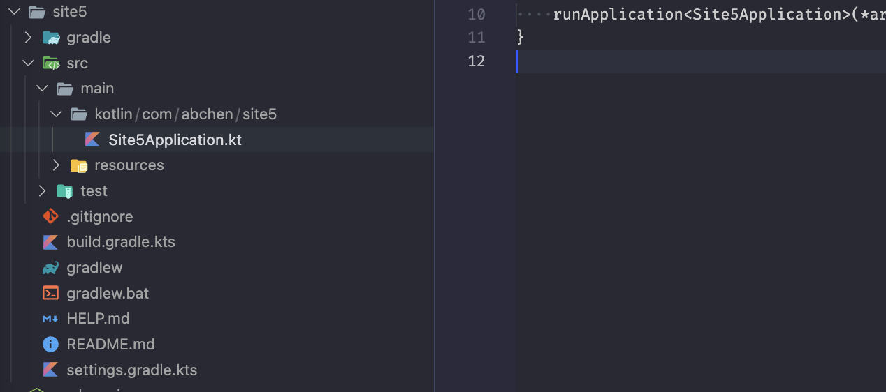

<h1 align=center>使用CLI创建Spring boot 项目</h1>

## install

```bash
# pnpm
pnpm add create-spring-boot-cli --global
# npm
npm install create-spring-boot-cli --global
# yarn
yarn add --global create-spring-boot-cli
```

## 使用

```bash
csbc
```
## 命令
```
Usage: create-spring-boot-cli [options] [command]

Options:
  -v, --version       版本信息
  -h, --help          display help for command

Commands:
  template [options]
  cache [options]
  mirror [options]
  create              创建Spring boot 项目
```

## 效果
  
  
  


## TODO
- 添加中文
- More